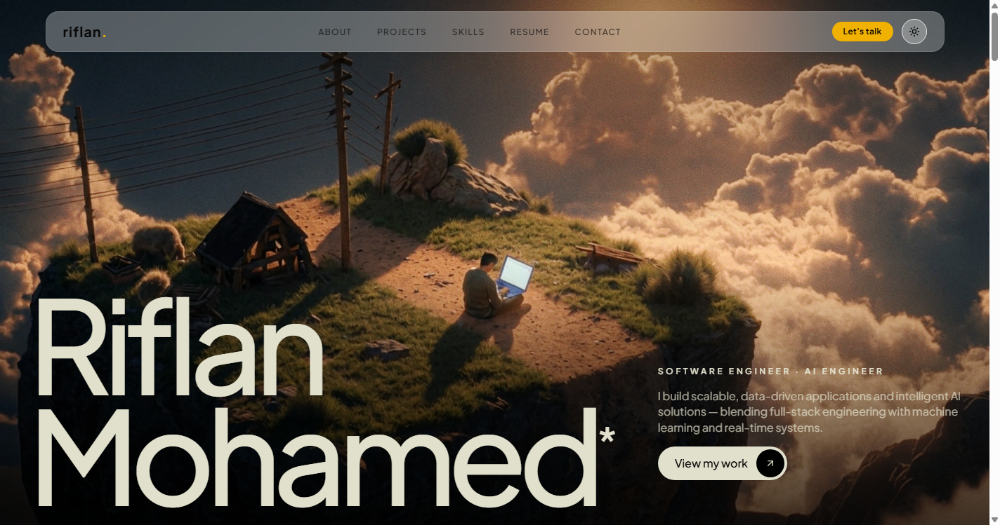

<div align="center">

# Riflan Mohamed — Portfolio

**Software Engineer & AI Developer** · Full-stack · Real-time systems

[](https://rizlan.me)
&nbsp;

&nbsp;

&nbsp;


<br/>



</div>

---

## Overview

My personal portfolio — a fast, animated, fully responsive single-page site that showcases my work in full-stack engineering and applied AI. Built from scratch with React 19 + TypeScript + Vite and Tailwind CSS v4, with motion handled by Framer Motion, GSAP and Three.js, and buttery scrolling via Lenis.

**Live:** [rizlan.me](https://rizlan.me)

## ✨ Features

- **Cinematic video hero** with a scroll-driven parallax effect (blur + zoom), a gradient fallback, and mobile-safe autoplay.
- **Interactive cursor** — a gooey pixel-trail that follows the pointer (desktop).
- **Scroll-driven sections** — a stacking project showcase, a stacking education-cards reveal, and scroll-scale transitions.
- **Typewriter quote band** cycling famous quotes.
- **"Ask me" section** with a chat-style prompt input.
- **Curved slide-in mobile menu** with an animated SVG edge and a close control.
- **Light / dark theme** across every section, respecting system preference.
- **Fully responsive** from 320px phones to large desktops, with a "best viewed on desktop" notice for small devices.
- **Smooth scrolling** (Lenis) and reduced-motion awareness.

## 🛠️ Tech Stack

| Area | Tools |
|---|---|
| **Core** | React 19, TypeScript, Vite |
| **Styling** | Tailwind CSS v4, shadcn-style components, `class-variance-authority` |
| **Animation** | Framer Motion, GSAP, Three.js, Lenis (smooth scroll) |
| **UI / Icons** | Radix UI, Lucide, custom brand icons |
| **Tooling** | ESLint, TypeScript strict mode |

## 🚀 Getting Started

> Requires **Node.js 20+**.

```bash
# clone
git clone https://github.com/RizAhd/Portfolio-Updated.git
cd Portfolio-Updated

# install
npm install

# run the dev server (http://localhost:5173)
npm run dev

# production build
npm run build

# preview the production build
npm run preview
```

## 📁 Project Structure

```
src/
├── App.tsx                  # Page composition
├── data/portfolio.ts        # All content (profile, projects, skills, …)
├── hooks/                   # theme, smooth-scroll, screen-size, parallax
├── components/
│   ├── navbar.tsx
│   ├── sections/            # hero-adjacent sections: about, projects, quote,
│   │                        #   skills, resume, education, ask-me, contact
│   └── ui/                  # reusable animated components & primitives
└── index.css                # theme tokens (light/dark) + global styles
```

## 🌐 Deployment

Deployed to **GitHub Pages** via GitHub Actions (`.github/workflows/deploy.yml`) on every push to `main`, served from the custom domain **rizlan.me** (see `public/CNAME`).

## 📫 Connect

- 🌐 Portfolio — [rizlan.me](https://rizlan.me)
- 💼 LinkedIn — [linkedin.com/in/riflan](https://www.linkedin.com/in/riflan/)
- 🐙 GitHub — [github.com/RizAhd](https://github.com/RizAhd)
- ✉️ Email — rizlanahmd4545@gmail.com

---

<div align="center">

Built by **Riflan Mohamed**. © 2026

</div>
